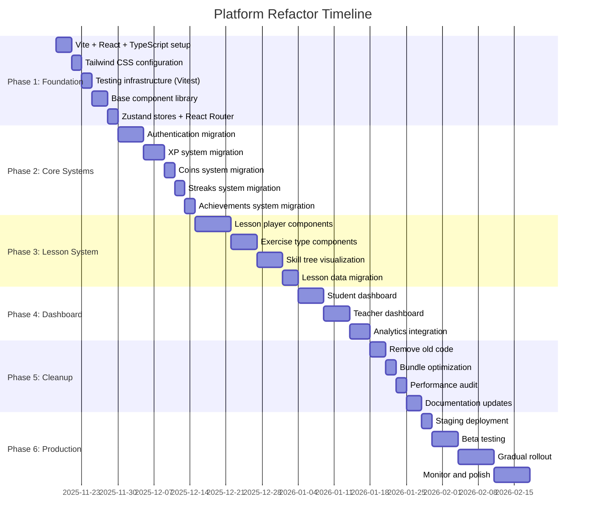

# Refactor Roadmap - Visual Timeline

**Status**: 🔴 PLANNING PHASE
**Duration**: 8-12 weeks
**Start Date**: TBD
**Approach**: Dual-run migration (old + new apps side-by-side)

---

## 📅 Visual Timeline

---

## 🎯 Phase Breakdown

### Phase 1: Foundation (Weeks 1-2)
**Goal**: New architecture ready without breaking current site
**Status**: 🔴 Not Started

| Task | Duration | Dependencies | Owner |
|------|----------|--------------|-------|
| Vite + React + TypeScript setup | 3 days | None | Dev |
| Tailwind CSS configuration | 2 days | Vite setup | Dev |
| Vitest + Testing Library setup | 2 days | Vite setup | Dev |
| Base atoms (Button, Input, Badge) | 3 days | Tailwind | Dev |
| Zustand stores scaffold | 2 days | TypeScript | Dev |
| React Router configuration | 2 days | None | Dev |

**Deliverables**:
- ✅ Empty React app running at `/app/` route
- ✅ 10+ atom components with Storybook docs
- ✅ First unit test passing
- ✅ CI/CD pipeline running tests

**Success Criteria**:
- Current site still works perfectly at `/`
- New React app loads in <1s
- All tests passing (even if just 1 test)

---

### Phase 2: Core Systems (Weeks 3-4)
**Goal**: Authentication and gamification working in new architecture
**Status**: 🔴 Not Started

| Task | Duration | Dependencies | Owner | Tests Required |
|------|----------|--------------|-------|----------------|
| Auth TypeScript types | 1 day | Foundation | Dev | Unit |
| Auth service layer | 2 days | Types | Dev | Unit + Integration |
| Auth React hooks | 1 day | Service | Dev | Component |
| Login/Signup pages | 1 day | Hooks | Dev | E2E |
| XP system pure functions | 1 day | None | Dev | Unit |
| XP service + hooks | 2 days | Functions | Dev | Unit + Integration |
| XPDisplay component | 1 day | Hooks | Dev | Component |
| Optimistic updates | 1 day | XPDisplay | Dev | Integration |
| Coins migration | 2 days | XP pattern | Dev | Unit + Component |
| Streaks migration | 2 days | XP pattern | Dev | Unit + Component |
| Achievements migration | 2 days | XP pattern | Dev | Unit + Component |

**Deliverables**:
- ✅ Can sign up, sign in, sign out in new app
- ✅ XP display with animations working
- ✅ Coins, streaks, achievements working
- ✅ All backend functions migrated to Edge Functions
- ✅ 80%+ test coverage on core systems

**Success Criteria**:
- Auth flow identical to current app
- XP calculations match exactly
- Optimistic updates working (instant feedback)
- All tests passing

---

### Phase 3: Lesson System (Weeks 5-7)
**Goal**: Lesson player and skill tree fully migrated
**Status**: 🔴 Not Started

| Task | Duration | Dependencies | Owner | Tests Required |
|------|----------|--------------|-------|----------------|
| Lesson TypeScript types | 2 days | Foundation | Dev | Unit |
| Exercise component base | 2 days | Types | Dev | Component |
| MultipleChoice exercise | 1 day | Base | Dev | Component |
| FillInBlank exercise | 1 day | Base | Dev | Component |
| DragAndDrop exercise | 1 day | Base | Dev | Component |
| Matching exercise | 1 day | Base | Dev | Component |
| Ordering exercise | 1 day | Base | Dev | Component |
| Lesson player state machine | 2 days | Exercises | Dev | Unit + Integration |
| Progress bar component | 1 day | State machine | Dev | Component |
| Completion modal | 1 day | State machine | Dev | Component |
| Lesson player page | 2 days | All above | Dev | E2E |
| Skill tree data structure | 2 days | Lesson types | Dev | Unit |
| Skill tree SVG rendering | 3 days | Data structure | Dev | Component |
| Skill tree interactions | 2 days | Rendering | Dev | Component + E2E |

**Deliverables**:
- ✅ All 5 exercise types working
- ✅ Lesson player with animations
- ✅ Skill tree visualization complete
- ✅ Sample lessons 1-6 migrated
- ✅ E2E test: complete lesson and earn XP

**Success Criteria**:
- All exercise types work on mobile
- Animations smooth (60fps)
- Progress saves to Supabase
- Skill tree responsive

---

### Phase 4: Dashboard & Analytics (Weeks 8-9)
**Goal**: Student and teacher dashboards built
**Status**: 🔴 Not Started

| Task | Duration | Dependencies | Owner | Tests Required |
|------|----------|--------------|-------|----------------|
| Dashboard data hooks | 2 days | Core systems | Dev | Unit + Integration |
| ProgressOverview component | 1 day | Data hooks | Dev | Component |
| LessonHistory component | 1 day | Data hooks | Dev | Component |
| AchievementShowcase component | 1 day | Data hooks | Dev | Component |
| StreakCalendar component | 2 days | Data hooks | Dev | Component |
| Student dashboard page | 1 day | All components | Dev | E2E |
| Teacher data aggregation | 2 days | None | Dev | Unit |
| ClassOverview component | 1 day | Teacher data | Dev | Component |
| StudentList component | 1 day | Teacher data | Dev | Component |
| Teacher dashboard page | 1 day | All components | Dev | E2E |
| Chart.js integration | 2 days | Dashboards | Dev | Visual |

**Deliverables**:
- ✅ Student dashboard with XP, streaks, achievements
- ✅ Teacher dashboard with class overview
- ✅ Charts and visualizations
- ✅ Real-time data updates (React Query)

**Success Criteria**:
- Dashboard loads in <2s
- Charts interactive and responsive
- Teacher can see all student progress

---

### Phase 5: Legacy Cleanup (Weeks 10-11)
**Goal**: Remove old code, optimize, polish
**Status**: 🔴 Not Started

| Task | Duration | Dependencies | Owner | Success Metric |
|------|----------|--------------|-------|----------------|
| Archive old js/ folder | 1 day | Phase 3 complete | Dev | Backup verified |
| Remove old HTML pages | 1 day | Phase 3 complete | Dev | Site still works |
| Delete styles.css | 1 day | Phase 3 complete | Dev | No visual regressions |
| Bundle size optimization | 2 days | Cleanup | Dev | <500KB target |
| Code splitting strategy | 2 days | Optimization | Dev | <200KB per chunk |
| Image optimization | 1 day | None | Dev | WebP format |
| Lighthouse audit | 1 day | All above | Dev | 90+ score |
| Service worker setup | 2 days | Optimization | Dev | Offline works |
| Error monitoring (Sentry) | 1 day | None | Dev | Errors tracked |
| Analytics (Plausible) | 1 day | None | Dev | Events tracked |

**Deliverables**:
- ✅ Old code archived and removed
- ✅ Bundle <500KB
- ✅ Lighthouse score 90+
- ✅ Monitoring and analytics live

**Success Criteria**:
- Site faster than before
- No dead code
- All metrics improved

---

### Phase 6: Production Deployment (Week 12)
**Goal**: Ship to production with monitoring
**Status**: 🔴 Not Started

| Task | Duration | Dependencies | Owner | Success Metric |
|------|----------|--------------|-------|----------------|
| Deploy to staging | 1 day | Phase 5 complete | Dev | Staging works |
| Beta test with 5 students | 5 days | Staging | Teacher | No blockers |
| Fix critical bugs | Variable | Beta testing | Dev | 0 critical bugs |
| Gradual rollout (25%) | 2 days | Beta success | Dev | Metrics stable |
| Gradual rollout (50%) | 2 days | 25% stable | Dev | Metrics stable |
| Full rollout (100%) | 2 days | 50% stable | Dev | All users migrated |
| Monitor and polish | 7 days | Full rollout | Dev | Error rate <1% |
| Archive old app | 1 day | 7 days stable | Dev | Backup complete |

**Deliverables**:
- ✅ 100% users on new app
- ✅ No critical bugs
- ✅ Metrics improved vs baseline
- ✅ Old app archived (not deleted)

**Success Criteria**:
- Error rate <1%
- Page load <1s
- User satisfaction high
- Teacher feedback positive

---

## 📊 Metrics Dashboard

### Before Refactor (Baseline)
| Metric | Current Value | Target Value |
|--------|---------------|--------------|
| **Performance** | | |
| Initial bundle size | ~800KB (unoptimized) | <500KB |
| Time to Interactive (TTI) | ~5s on 3G | <3s |
| Lighthouse Performance | ~70 | 90+ |
| **Code Quality** | | |
| Test coverage | 0% | 80%+ |
| TypeScript usage | 0% | 100% |
| Lines per file (avg) | 450 lines | <300 lines |
| Cyclomatic complexity | 30+ (game.js) | <10 |
| **User Experience** | | |
| D1 retention | 50% (estimated) | 60% |
| D7 retention | 40% (estimated) | 50% |
| Bug reports/month | ~10 | <2 |
| **Developer Experience** | | |
| Hot reload | ❌ No | ✅ Yes (<50ms) |
| Type safety | ❌ No | ✅ Yes (strict) |
| Dev server start | ~5s (open HTML) | <1s (Vite) |

### After Refactor (Target)
All metrics in "Target Value" column above.

---

## 🎯 Quick Reference - Who Does What

### Developer Tasks
- ✅ Write code (React components, hooks, services)
- ✅ Write tests (unit, component, E2E)
- ✅ Code reviews (PR reviews)
- ✅ Deploy to staging
- ✅ Monitor production (Sentry, analytics)

### Teacher Tasks
- ✅ Beta testing (5 students, 1 week)
- ✅ Provide feedback (usability issues)
- ✅ Test lesson content (accuracy)
- ✅ Approve for production launch

### Student Tasks (Beta)
- ✅ Use new app (complete 3 lessons)
- ✅ Report bugs (Google Form)
- ✅ Provide feedback (survey)

---

## 🚦 Go/No-Go Criteria

### Phase 1 → Phase 2
- [ ] React app loads without errors
- [ ] At least 1 unit test passing
- [ ] CI/CD pipeline running
- [ ] Current site unaffected

### Phase 2 → Phase 3
- [ ] Can sign up, sign in, sign out
- [ ] XP system works identically to old app
- [ ] All core systems tested (80%+ coverage)
- [ ] No regressions in current site

### Phase 3 → Phase 4
- [ ] Lesson player functional
- [ ] All 5 exercise types work
- [ ] Skill tree renders correctly
- [ ] E2E test passing: complete lesson

### Phase 4 → Phase 5
- [ ] Student dashboard functional
- [ ] Teacher dashboard functional
- [ ] Charts rendering correctly
- [ ] No performance regressions

### Phase 5 → Phase 6
- [ ] Bundle <500KB
- [ ] Lighthouse >90
- [ ] Old code removed
- [ ] Monitoring in place

### Phase 6 → Done
- [ ] Beta test successful (0 critical bugs)
- [ ] 100% users migrated
- [ ] Metrics improved vs baseline
- [ ] Teacher approval

---

## 🎉 Completion Checklist

### Code
- [ ] All old JavaScript files deleted
- [ ] All old HTML pages archived
- [ ] styles.css removed
- [ ] All components migrated to React
- [ ] All state in Zustand stores
- [ ] All data fetching via React Query

### Tests
- [ ] 80%+ unit test coverage
- [ ] 60%+ component test coverage
- [ ] 100% E2E critical paths covered
- [ ] All tests passing on CI

### Performance
- [ ] Bundle <500KB
- [ ] TTI <3s on 3G
- [ ] Lighthouse 90+
- [ ] Images optimized (WebP)

### Documentation
- [ ] docs/REFACTOR-PLAN.md updated with "COMPLETED" status
- [ ] docs/architecture/ updated with new architecture
- [ ] .claude/CLAUDE.md updated
- [ ] README.md updated
- [ ] CHANGELOG.md created

### Deployment
- [ ] Staging deployment successful
- [ ] Beta test complete (5 students)
- [ ] Production deployment successful
- [ ] Monitoring active (Sentry + Plausible)
- [ ] Old app archived

### Sign-off
- [ ] Developer sign-off (all code complete)
- [ ] Teacher sign-off (usability approved)
- [ ] Product owner sign-off (goals met)

---

**End of Refactor Roadmap**
**Last Updated**: November 15, 2025
