```mermaid
graph TB
    %% USER ENTRY POINTS
    User([👤 User Browser])

    %% PAGES
    Index[🏠 index.html<br/>🟢 LOADS<br/>🟢 XP Display Fixed<br/>🟡 Needs Testing]
    Login[🔐 auth/login.html<br/>🟢 WORKING]
    Signup[📝 auth/signup.html<br/>🟢 WORKING]
    Profile[👤 auth/profile.html<br/>🟡 UNTESTED]
    LessonMap[🗺️ lesson-map.html<br/>🟢 WORKING<br/>🟢 Skill Tree Renders<br/>🟢 Lessons Clickable]
    LessonPlayer[🎮 lesson-player.html<br/>🟢 Resume Dialog Fixed<br/>🟡 Needs Full Test]
    Dashboard[📊 dashboard.html<br/>🟡 NEEDS BUILD]
    Achievements[🏆 achievements.html<br/>🟡 NEEDS BUILD]

    %% CSS ARCHITECTURE
    subgraph CSS["🎨 CSS Architecture"]
        direction TB
        StylesCSS[styles.css<br/>🟢 LEGACY 84KB<br/>🟢 Loads First Now<br/>🟡 Needs Migration]
        MainCSS[main.css<br/>🟢 Atomic Design Entry<br/>🟢 Fixed Import Order]

        subgraph Atomic["🔧 Atomic Design System"]
            Foundation[Foundation<br/>🟢 tokens.css<br/>🟢 reset.css<br/>🟢 base.css]
            Atoms[Atoms<br/>🟢 buttons.css<br/>🟡 typography.css<br/>🟡 spacing.css]
            Molecules[Molecules<br/>🟢 cards.css<br/>🟡 forms.css<br/>🟢 rewards.css]
            Organisms[Organisms<br/>🟡 header.css<br/>🟡 navigation.css<br/>🟢 hero-lesson.css]
            Utilities[Utilities<br/>🟢 helpers.css<br/>🟢 layout.css]
        end

        PageCSS[Page-Specific CSS<br/>🟡 dashboard.css<br/>🟡 lesson-player.css<br/>🟡 achievements.css<br/>🟡 skill-tree.css]
    end

    %% FRONTEND JAVASCRIPT
    subgraph Frontend["⚙️ Frontend JavaScript"]
        direction TB

        subgraph Auth["🔐 Authentication"]
            SupabaseClient[supabase-client.js<br/>🟢 WORKING]
            AuthManager[auth-manager.js<br/>🟢 WORKING]
        end

        subgraph Features["✨ Features"]
            SkillTree[skill-tree.js<br/>🟢 Data Loading]
            SkillTreeRenderer[skill-tree-renderer.js<br/>🟢 Rendering Works]
            LessonScheduler[lesson-scheduler.js<br/>🟡 UNTESTED]

            XPSystem[xp-system.js<br/>🟡 Class Exists<br/>🟢 Fixed: window.xpSystem]
            CoinSystem[coin-system.js<br/>🟡 Class Exists<br/>🟢 Fixed: window.coinSystem]

            AchievementSys[achievement-system.js<br/>🟡 UNTESTED]
            StreakTracker[streak-tracker.js<br/>🟡 UNTESTED]

            GameCore[game.js<br/>🟡 OLD PRACTICE MODE<br/>🟡 Low Priority Fix]
            AdaptiveLearning[adaptive-learning.js<br/>🟡 UNTESTED]
        end

        subgraph UI["🎨 UI Components"]
            CoinDisplay[coin-display.js<br/>🟢 Fixed Method Calls<br/>🟢 Async/Await]
            XPDisplay[xp-display.js<br/>🟢 CREATED & FIXED<br/>🟡 Needs Testing]
            StreakDisplay[streak-display.js<br/>🟡 UNTESTED]
            AchievementDisplay[achievement-display.js<br/>🟡 UNTESTED]
            LessonPreview[lesson-preview.js<br/>🟡 UNTESTED]
        end
    end

    %% BACKEND
    subgraph Backend["☁️ Backend (Netlify + Supabase)"]
        direction TB

        subgraph Supabase["🗄️ Supabase PostgreSQL"]
            DB[(Database)]

            ProfilesTable[profiles<br/>🟢 FIXED RLS Policy<br/>🟢 No Infinite Recursion]
            LessonsTable[lessons<br/>🟢 87 Lessons Seeded]
            ProgressTable[lesson_progress<br/>🟡 UNTESTED]
            AchievementsTable[achievements<br/>🟢 44 Achievements Seeded]
            UserAchievements[user_achievements<br/>🟡 UNTESTED]
            XPHistory[xp_history<br/>🟡 Schema Mismatch Fixed]
            CoinHistory[coin_history<br/>🟡 Schema Mismatch Fixed]
            Streaks[daily_streaks<br/>🟡 UNTESTED]
        end

        subgraph Functions["⚡ Netlify Functions"]
            AwardXP[award-xp.js<br/>🟢 TESTED<br/>🟢 Column Names Fixed]
            AwardCoins[award-coins.js<br/>🟢 Column Names Fixed<br/>🟡 UNTESTED]
            AwardAchievement[award-achievement.js<br/>🟡 Column Names Fixed<br/>🟡 UNTESTED]
            UpdateStreak[update-streak.js<br/>🟡 Column Names Fixed<br/>🟡 UNTESTED]
            CheckStreak[check-streak.js<br/>🟡 UNTESTED]
            GetUserStats[get-user-stats.js<br/>🟡 Column Names Fixed<br/>🟡 UNTESTED]
            GetStudentProgress[get-student-progress.js<br/>🟡 UNTESTED]
            GetClassProgress[get-class-progress.js<br/>🟡 UNTESTED]
            SpendCoins[spend-coins.js<br/>🟡 UNTESTED]
            GeminiAPI[gemini-api.js<br/>🟡 UNTESTED]
        end
    end

    %% ROUTING & NAVIGATION
    subgraph Routing["🔀 Routing & Navigation"]
        direction LR
        Route1["/ to index.html<br/>🟢 WORKS"]
        Route2["/auth/login to login.html<br/>🟢 WORKS"]
        Route3["/auth/signup to signup.html<br/>🟢 WORKS"]
        Route4["/lesson-map to lesson-map.html<br/>🟢 WORKS"]
        Route5["/lesson-player to lesson-player.html<br/>🟢 Resume Bug Fixed"]
        Route6["/dashboard to dashboard.html<br/>🟡 UNTESTED"]
        Route7["/achievements to achievements.html<br/>🟡 UNTESTED"]
        Route8["/api/* to Netlify Functions<br/>🟢 WORKS"]
    end

    %% BUILD & DEPLOYMENT
    subgraph Build["🔨 Build & Deploy"]
        BuildJS[build.js<br/>🟢 Injects Env Vars<br/>🟢 Generates env-inject.js]
        EnvInject[env-inject.js<br/>🟢 Auto-Generated<br/>🟢 Loads on All Pages]
        NetlifyTOML[netlify.toml<br/>🟢 Functions Path Set<br/>🟢 Redirects Working]
        Deployment[Netlify CDN<br/>🟢 DEPLOYED<br/>https://7th-grade-pre-algebra.netlify.app]
    end

    %% CONNECTIONS - USER FLOW
    User -->|Visit Site| Index
    User -->|Click Login| Login
    User -->|Click Signup| Signup

    Login -->|Success| Index
    Signup -->|Success| Index
    Index -->|Click Lesson Map| LessonMap
    Index -->|Click Dashboard| Dashboard
    Index -->|Click Achievements| Achievements
    LessonMap -->|Click Lesson| LessonPlayer

    %% CONNECTIONS - CSS
    Index -.->|Loads| StylesCSS
    Index -.->|Loads| MainCSS
    MainCSS -.->|Imports| Foundation
    MainCSS -.->|Imports| Atoms
    MainCSS -.->|Imports| Molecules
    MainCSS -.->|Imports| Organisms
    MainCSS -.->|Imports| Utilities
    MainCSS -.->|🟢 FIXED: Imports First| StylesCSS

    Index -.->|Loads| PageCSS
    LessonMap -.->|Loads| PageCSS

    %% CONNECTIONS - FRONTEND JS
    Index -->|Initializes| SupabaseClient
    SupabaseClient -->|Uses| AuthManager

    LessonMap -->|Uses| SkillTree
    LessonMap -->|Uses| SkillTreeRenderer
    SkillTree -->|Fetches Data| LessonsTable
    SkillTree -->|Fetches Data| ProgressTable

    Index -->|🟢 FIXED: Calls| CoinDisplay
    CoinDisplay -->|🟢 FIXED: Calls| CoinSystem
    CoinSystem -->|Fetches| ProfilesTable
    CoinSystem -->|Fetches| CoinHistory

    Index -->|🟢 FIXED: Loads| XPDisplay
    XPDisplay -->|🟢 Calls| XPSystem
    XPSystem -->|Fetches| ProfilesTable
    XPSystem -->|Fetches| XPHistory

    GameCore -->|🟡 OLD: Uses Local State| XPSystem
    GameCore -->|🟡 OLD: Uses Local State| CoinSystem

    %% CONNECTIONS - BACKEND
    SupabaseClient -->|Connects| DB

    AuthManager -->|Creates User| ProfilesTable
    AuthManager -->|🟢 FIXED: No More Infinite Recursion| ProfilesTable

    XPSystem -->|Calls| AwardXP
    CoinSystem -->|Calls| AwardCoins
    AchievementSys -->|Calls| AwardAchievement
    StreakTracker -->|Calls| UpdateStreak
    StreakTracker -->|Calls| CheckStreak

    AwardXP -->|🟢 Updates| ProfilesTable
    AwardXP -->|🟢 Inserts| XPHistory
    AwardCoins -->|🟢 Updates| ProfilesTable
    AwardCoins -->|🟢 Inserts| CoinHistory

    %% CONNECTIONS - BUILD
    BuildJS -->|Generates| EnvInject
    EnvInject -->|Provides Config| SupabaseClient
    NetlifyTOML -->|Deploys| Deployment
    NetlifyTOML -->|Configures| Functions

    %% STYLING
    classDef working fill:#4ade80,stroke:#22c55e,stroke-width:3px,color:#000
    classDef partial fill:#fbbf24,stroke:#f59e0b,stroke-width:3px,color:#000
    classDef broken fill:#f87171,stroke:#ef4444,stroke-width:3px,color:#000
    classDef notImpl fill:#9ca3af,stroke:#6b7280,stroke-width:2px,color:#000

    %% Apply styles
    class Login,Signup,LessonMap,SupabaseClient,AuthManager,SkillTree,SkillTreeRenderer,ProfilesTable,LessonsTable,AchievementsTable,AwardXP,CoinDisplay,CoinSystem,XPSystem,BuildJS,EnvInject,NetlifyTOML,Deployment,Route1,Route2,Route3,Route4,Route8,Foundation,Atoms,Molecules,Organisms,Utilities working

    class Index,Profile,LessonPlayer,Dashboard,Achievements,MainCSS,PageCSS,LessonScheduler,AchievementSys,StreakTracker,StreakDisplay,AchievementDisplay,LessonPreview,ProgressTable,XPHistory,CoinHistory,Streaks,AwardCoins,AwardAchievement,UpdateStreak,CheckStreak,GetUserStats,GetStudentProgress,GetClassProgress,SpendCoins,GeminiAPI,Route5,Route6,Route7,AdaptiveLearning partial

    class GameCore broken
```

# System Architecture Status - Visual Flowchart

**Generated:** 2025-11-15
**Status Legend:**
- 🟢 **GREEN** = Tested & Working
- 🟡 **AMBER** = Partially Working / Needs Fixes
- 🔴 **RED** = Broken / Not Working
- ⚪ **GRAY** = Not Implemented

---

---

## Critical Issues Summary

### 🔴 **BROKEN (Must Fix Immediately)**

1. ~~**styles.css Conflicts** - 84KB legacy file overrides atomic design~~ ✅ **FIXED** - Now loads first
2. ~~**CSS Import Order** - Legacy loads LAST, should load FIRST~~ ✅ **FIXED** - Moved to top of main.css
3. ~~**XP Display Missing** - No xp-display.js file exists~~ ✅ **FIXED** - Created and fixed initialization
4. ~~**Resume Dialog Bug** - Confirm dialog appears on page load, blocks navigation~~ ✅ **FIXED** - Only shows when clicking "Start Story Mode"
5. **game.js Broken** - Uses local state instead of XP/Coin systems (low priority - old practice mode)

### 🟡 **NEEDS TESTING (High Priority)**

1. **All Backend Functions** - Only award-xp.js has been tested
2. **Dashboard Page** - Not tested since deployment
3. **Achievements Page** - Not tested since deployment
4. **Profile Page** - Not tested since deployment
5. **Lesson Player** - Partially working, needs full test
6. **Streak System** - Backend exists, frontend untested
7. **Achievement System** - Backend exists, frontend untested

### 🟢 **WORKING (Verified)**

1. **Authentication Flow** - Login, signup working
2. **Lesson Map** - Skill tree renders, lessons clickable
3. **Supabase Integration** - Database connected, RLS fixed
4. **Environment Variables** - Auto-injection working
5. **Netlify Deployment** - Build and deploy working
6. **Backend Column Fixes** - All functions updated to use correct schema

---

## Recommended Fix Order

### **Phase 1: Emergency Fixes (COMPLETED ✅)**

1. ✅ **CSS Import Order** - [css/main.css](css/main.css) - styles.css now loads FIRST
2. ✅ **XP Display Created** - [js/ui/xp-display.js](js/ui/xp-display.js) - window.xpSystem fixed
3. ✅ **Resume Dialog Bug** - [js/core/game.js](js/core/game.js:39-40,133-144) - Only shows when clicking "Start Story Mode"
4. ✅ **Deployed** - https://7th-grade-pre-algebra.netlify.app
5. ⏳ Remove inline styles from all pages (Pending)

### **Phase 2: Documentation & Organization (COMPLETED ✅)**

1. ✅ **Documentation System** - [docs/DOCUMENTATION-GUIDE.md](DOCUMENTATION-GUIDE.md) - Complete archival guide
2. ✅ **Archive Script** - [scripts/docs-archive.sh](../scripts/docs-archive.sh) - Automated archival tool
3. ✅ **Docs Cleanup** - Archived 4 old deployment reports to [docs/archive/2025-11/](archive/2025-11/)
4. ✅ **Docs Index** - Updated [docs/README.md](README.md) with organized documentation index
5. ✅ **Mermaid Syntax Fix** - Fixed routing arrows that caused render errors

### **Phase 3: Critical Testing (This Week)**

1. ⏳ Test all backend functions
2. ⏳ Test dashboard page
3. ⏳ Test achievements page
4. ⏳ Test profile page
5. ⏳ Full end-to-end lesson completion flow

### **Phase 4: CSS Refactoring (Next Week)**

1. ⏳ Migrate styles.css to atomic design
2. ⏳ Remove duplicate components
3. ⏳ Consolidate headers, buttons, cards
4. ⏳ Create missing atomic components

---

**Last Updated:** 2025-11-15
**Production URL:** https://7th-grade-pre-algebra.netlify.app
