```mermaid
graph TB
    %% USER ENTRY POINTS
    User([👤 User Browser])

    %% PAGES
    Index["🏠 index.html<br/>🟢 LOADS | 🟢 XP Display Fixed<br/>🟡 NEXT: Test XP/Coin Display<br/>👤 Agent: test-agent<br/>📍 Why: Homepage entry, loads game.js"]
    Login["🔐 auth/login.html<br/>🟢 WORKING | ✅ Tested<br/>📍 Why: User authentication entry<br/>🔧 Uses: AuthManager, SupabaseClient"]
    Signup["📝 auth/signup.html<br/>🟢 WORKING | ✅ Tested<br/>📍 Why: New user registration<br/>🔧 Creates: Profile in Supabase"]
    Profile["👤 auth/profile.html<br/>🟡 UNTESTED<br/>🟡 NEXT: Test profile loading<br/>👤 Agent: test-agent<br/>📍 Why: User profile management"]
    LessonMap["🗺️ lesson-map.html<br/>🟢 WORKING | ✅ Skill Tree Renders<br/>🟢 87 Lessons Clickable<br/>📍 Why: Main lesson navigation<br/>🔧 Uses: SkillTree, SkillTreeRenderer"]
    LessonPlayer["🎮 lesson-player.html<br/>🟢 Resume Bug Fixed<br/>🟡 NEXT: Full E2E Test<br/>👤 Agent: test-agent<br/>📍 Why: Interactive lesson delivery<br/>🔧 Awards: XP, Coins, Achievements"]
    Dashboard["📊 dashboard.html<br/>🔴 NEEDS BUILD<br/>🔴 NEXT: Create student dashboard<br/>👤 Agent: frontend-agent<br/>📍 Why: Student progress tracking<br/>🔧 Shows: Stats, Streaks, Progress"]
    Achievements["🏆 achievements.html<br/>🟡 PARTIAL | 44 Badges Defined<br/>🟡 NEXT: Test badge unlocking<br/>👤 Agent: test-agent<br/>📍 Why: Gamification motivation<br/>🔧 Displays: 44 achievement badges"]

    %% CSS ARCHITECTURE
    subgraph CSS["🎨 CSS Architecture"]
        direction TB
        StylesCSS["styles.css<br/>🟢 LEGACY 84KB 4887 lines<br/>✅ FIXED: Now loads FIRST<br/>🟡 NEXT: Migrate to atomic<br/>👤 Agent: ui-update-agent<br/>📍 Why: Prevents override conflicts"]
        MainCSS["main.css<br/>🟢 Atomic Design Entry<br/>✅ FIXED: Import order<br/>📍 Why: Central CSS orchestrator<br/>🔧 Imports: All atomic layers"]

        subgraph Atomic["🔧 Atomic Design System"]
            Foundation["Foundation<br/>🟢 tokens.css - Design vars<br/>🟢 reset.css - CSS reset<br/>🟢 base.css - Base styles<br/>📍 Why: Core design system"]
            Atoms["Atoms<br/>🟢 buttons.css - Button styles<br/>🟡 typography.css - Text styles<br/>🟡 spacing.css - Margin/padding<br/>👤 Agent: ui-update-agent<br/>📍 Why: Basic UI building blocks"]
            Molecules["Molecules<br/>🟢 cards.css - Card components<br/>🟡 forms.css - Form elements<br/>🟢 rewards.css - XP/Coin display<br/>📍 Why: Simple component combos"]
            Organisms["Organisms<br/>🟡 header.css - Site header<br/>🟡 navigation.css - Nav menus<br/>🟢 hero-lesson.css - Lesson hero<br/>👤 Agent: ui-update-agent<br/>📍 Why: Complex UI sections"]
            Utilities["Utilities<br/>🟢 helpers.css - Utility classes<br/>🟢 layout.css - Grid/flex<br/>📍 Why: Layout and helper classes"]
        end

        PageCSS["Page-Specific CSS<br/>🟡 dashboard.css - Dashboard page<br/>🟡 lesson-player.css - Lesson UI<br/>🟡 achievements.css - Badge gallery<br/>🟡 skill-tree.css - Lesson map<br/>👤 Agent: frontend-agent<br/>📍 Why: Page-specific styling"]
    end

    %% FRONTEND JAVASCRIPT
    subgraph Frontend["⚙️ Frontend JavaScript"]
        direction TB

        subgraph Auth["🔐 Authentication"]
            SupabaseClient["supabase-client.js<br/>🟢 WORKING | ✅ Tested<br/>📍 Why: Supabase connection<br/>🔧 Exports: supabase instance<br/>✅ Fixed: No more infinite RLS"]
            AuthManager["auth-manager.js<br/>🟢 WORKING | ✅ Tested<br/>📍 Why: Auth operations<br/>🔧 Methods: signup, signin, signout<br/>✅ Creates user profiles"]
        end

        subgraph Features["✨ Features"]
            SkillTree["skill-tree.js<br/>🟢 Data Loading<br/>🟢 87 Lessons Loaded<br/>📍 Why: Lesson progression<br/>🔧 Fetches: lessons, progress<br/>🟡 NEXT: Test progress tracking"]
            SkillTreeRenderer["skill-tree-renderer.js<br/>🟢 Rendering Works<br/>✅ Visual skill tree<br/>📍 Why: Renders lesson map<br/>🔧 Shows: Locked/unlocked/complete"]
            LessonScheduler["lesson-scheduler.js<br/>🟡 UNTESTED<br/>🟡 NEXT: Test B-day scheduling<br/>👤 Agent: test-agent<br/>📍 Why: Maps lessons to dates<br/>🔧 Uses: B-day calendar JSON"]

            XPSystem["xp-system.js<br/>🟢 Class Exists<br/>✅ FIXED: window.xpSystem lowercase<br/>📍 Why: XP tracking & leveling<br/>🔧 Methods: awardXP, getUserStats<br/>🟡 NEXT: Test with lesson player"]
            CoinSystem["coin-system.js<br/>🟢 Class Exists<br/>✅ FIXED: window.coinSystem lowercase<br/>📍 Why: Coin economy<br/>🔧 Methods: awardCoins, spendCoins<br/>🟡 NEXT: Test coin transactions"]

            AchievementSys["achievement-system.js<br/>🟡 UNTESTED<br/>🟡 NEXT: Test achievement unlocking<br/>👤 Agent: test-agent<br/>📍 Why: Badge system<br/>🔧 44 achievements defined<br/>🔧 Awards: First lesson, Streaks, etc"]
            StreakTracker["streak-tracker.js<br/>🟡 UNTESTED<br/>🟡 NEXT: Test streak tracking<br/>👤 Agent: test-agent<br/>📍 Why: Daily engagement<br/>🔧 B-days only counting<br/>🔧 Milestone: 3,7,14,30,60,100 days"]

            GameCore["game.js<br/>🟡 OLD PRACTICE MODE<br/>✅ Resume bug fixed<br/>🟡 NEXT: Integrate with XP/Coin<br/>👤 Agent: analyze-agent<br/>📍 Why: Legacy practice mode<br/>🔧 Uses local storage not Supabase"]
            AdaptiveLearning["adaptive-learning.js<br/>🟡 UNTESTED<br/>🟡 NEXT: Test difficulty adjustment<br/>👤 Agent: test-agent<br/>📍 Why: Personalized difficulty<br/>🔧 Adjusts based on performance"]
        end

        subgraph UI["🎨 UI Components"]
            CoinDisplay["coin-display.js<br/>🟢 Fixed Method Calls<br/>✅ FIXED: Async/await<br/>✅ FIXED: Method names<br/>📍 Why: Shows coin balance<br/>🔧 Calls: coinSystem.getCoinsBalance<br/>🟡 NEXT: Test on index.html"]
            XPDisplay["xp-display.js<br/>🟢 CREATED & FIXED<br/>✅ FIXED: window.xpSystem<br/>📍 Why: Shows XP/level<br/>🔧 Displays: Level, progress bar<br/>🟡 NEXT: Test XP animations"]
            StreakDisplay["streak-display.js<br/>🟡 UNTESTED<br/>🟡 NEXT: Test streak flame UI<br/>👤 Agent: test-agent<br/>📍 Why: Shows daily streak<br/>🔧 Displays: Flame emoji counter"]
            AchievementDisplay["achievement-display.js<br/>🟡 UNTESTED<br/>🟡 NEXT: Test badge modals<br/>👤 Agent: test-agent<br/>📍 Why: Shows earned badges<br/>🔧 Displays: Purple gradient modals"]
            LessonPreview["lesson-preview.js<br/>🟡 UNTESTED<br/>🟡 NEXT: Test lesson cards<br/>👤 Agent: test-agent<br/>📍 Why: Preview before starting<br/>🔧 Shows: Title, standard, objectives"]
        end
    end

    %% BACKEND
    subgraph Backend["☁️ Backend (Netlify + Supabase)"]
        direction TB

        subgraph Supabase["🗄️ Supabase PostgreSQL"]
            DB[("Database<br/>fejyyntdbqlighscjvre<br/>8 tables | RLS enabled")]

            ProfilesTable["profiles<br/>✅ FIXED RLS: Uses auth.jwt not SELECT<br/>✅ FIXED: Column id not user_id<br/>📍 Why: User accounts<br/>🔧 Columns: id, username, level, xp, coins<br/>🟡 NEXT: Test RLS policies"]
            LessonsTable["lessons<br/>🟢 87 Lessons Seeded<br/>📍 Why: Curriculum data<br/>🔧 B-days only 2025-2026<br/>✅ All 4 quarters loaded<br/>🔧 MA.8.XXX standards"]
            ProgressTable["lesson_progress<br/>🟡 UNTESTED<br/>🟡 NEXT: Test progress tracking<br/>👤 Agent: test-agent<br/>📍 Why: Student progress<br/>🔧 Tracks: status, score, time, attempts"]
            AchievementsTable["achievements<br/>🟢 44 Achievements Seeded<br/>📍 Why: Badge definitions<br/>🔧 Categories: 6 types<br/>✅ Completion, Accuracy, Speed, etc"]
            UserAchievements["user_achievements<br/>🟡 UNTESTED<br/>🟡 NEXT: Test badge unlocking<br/>👤 Agent: test-agent<br/>📍 Why: User badges earned<br/>🔧 Links: user_id + achievement_id"]
            XPHistory["xp_history<br/>✅ FIXED: Schema matches inserts<br/>🟡 NEXT: Test history tracking<br/>👤 Agent: test-agent<br/>📍 Why: XP transaction log<br/>🔧 Columns: user_id, amount, source"]
            CoinHistory["coin_history<br/>✅ FIXED: Schema matches inserts<br/>🟡 NEXT: Test coin history<br/>👤 Agent: test-agent<br/>📍 Why: Coin transaction log<br/>🔧 Columns: user_id, amount, type, source"]
            Streaks["daily_streaks<br/>🟡 UNTESTED<br/>🟡 NEXT: Test streak tracking<br/>👤 Agent: test-agent<br/>📍 Why: Daily engagement B-days<br/>🔧 Columns: user_id, date, lessons_completed"]
        end

        subgraph Functions["⚡ Netlify Functions"]
            AwardXP["award-xp.js<br/>🟢 TESTED & WORKING<br/>✅ FIXED: .eq id not user_id<br/>✅ FIXED: XP history schema<br/>📍 Why: Awards XP for lessons<br/>🔧 Updates: profiles.total_xp, level<br/>🔧 Test: User leveled 1→2 ✅"]
            AwardCoins["award-coins.js<br/>✅ FIXED: Column names<br/>✅ FIXED: Coin history schema<br/>🟡 NEXT: Test coin awarding<br/>👤 Agent: test-agent<br/>📍 Why: Awards coins for lessons<br/>🔧 Updates: profiles.coins"]
            AwardAchievement["award-achievement.js<br/>✅ FIXED: Column names<br/>🟡 NEXT: Test badge awarding<br/>👤 Agent: test-agent<br/>📍 Why: Unlocks achievements<br/>🔧 Inserts: user_achievements<br/>🔧 Triggers: Frontend toast notification"]
            UpdateStreak["update-streak.js<br/>✅ FIXED: Column names<br/>🟡 NEXT: Test B-day streak logic<br/>👤 Agent: test-agent<br/>📍 Why: Updates daily streaks<br/>🔧 Checks: B-day schedule only<br/>🔧 Awards: Milestone achievements"]
            CheckStreak["check-streak.js<br/>🟡 UNTESTED<br/>🟡 NEXT: Test streak status<br/>👤 Agent: test-agent<br/>📍 Why: Checks current streak<br/>🔧 Returns: current, longest streak"]
            GetUserStats["get-user-stats.js<br/>✅ FIXED: Column names<br/>🟡 NEXT: Test stats fetching<br/>👤 Agent: test-agent<br/>📍 Why: Get user stats<br/>🔧 Returns: xp, level, coins, streaks"]
            GetStudentProgress["get-student-progress.js<br/>✅ FIXED: Column names<br/>🟡 NEXT: Test progress query<br/>👤 Agent: test-agent<br/>📍 Why: Student dashboard data<br/>🔧 Returns: lessons completed, scores"]
            GetClassProgress["get-class-progress.js<br/>🟡 UNTESTED<br/>🟡 NEXT: Test class aggregation<br/>👤 Agent: test-agent<br/>📍 Why: Teacher dashboard<br/>🔧 Returns: Class average, completion"]
            SpendCoins["spend-coins.js<br/>🟡 UNTESTED<br/>🟡 NEXT: Test coin deduction<br/>👤 Agent: test-agent<br/>📍 Why: Coin store purchases<br/>🔧 Updates: profiles.coins<br/>🔧 Validates: Sufficient balance"]
            GeminiAPI["gemini-api.js<br/>🟡 UNTESTED<br/>🟡 NEXT: Test AI hint generation<br/>👤 Agent: test-agent<br/>📍 Why: AI-powered hints<br/>🔧 Uses: Gemini API for help<br/>🔧 Context: Lesson standard, problem"]
        end
    end

    %% ROUTING & NAVIGATION
    subgraph Routing["🔀 Routing & Navigation"]
        direction LR
        Route1["/ to index.html<br/>🟢 WORKS"]
        Route2["/auth/login to login.html<br/>🟢 WORKS"]
        Route3["/auth/signup to signup.html<br/>🟢 WORKS"]
        Route4["/lesson-map to lesson-map.html<br/>🟢 WORKS"]
        Route5["/lesson-player to lesson-player.html<br/>🟢 Resume Bug Fixed"]
        Route6["/dashboard to dashboard.html<br/>🟡 UNTESTED"]
        Route7["/achievements to achievements.html<br/>🟡 UNTESTED"]
        Route8["/api/* to Netlify Functions<br/>🟢 WORKS"]
    end

    %% BUILD & DEPLOYMENT
    subgraph Build["🔨 Build & Deploy"]
        BuildJS[build.js<br/>🟢 Injects Env Vars<br/>🟢 Generates env-inject.js]
        EnvInject[env-inject.js<br/>🟢 Auto-Generated<br/>🟢 Loads on All Pages]
        NetlifyTOML[netlify.toml<br/>🟢 Functions Path Set<br/>🟢 Redirects Working]
        Deployment[Netlify CDN<br/>🟢 DEPLOYED<br/>https://7th-grade-pre-algebra.netlify.app]
    end

    %% CONNECTIONS - USER FLOW
    User -->|Visit Site| Index
    User -->|Click Login| Login
    User -->|Click Signup| Signup

    Login -->|Success| Index
    Signup -->|Success| Index
    Index -->|Click Lesson Map| LessonMap
    Index -->|Click Dashboard| Dashboard
    Index -->|Click Achievements| Achievements
    LessonMap -->|Click Lesson| LessonPlayer

    %% CONNECTIONS - CSS
    Index -.->|Loads| StylesCSS
    Index -.->|Loads| MainCSS
    MainCSS -.->|Imports| Foundation
    MainCSS -.->|Imports| Atoms
    MainCSS -.->|Imports| Molecules
    MainCSS -.->|Imports| Organisms
    MainCSS -.->|Imports| Utilities
    MainCSS -.->|🟢 FIXED: Imports First| StylesCSS

    Index -.->|Loads| PageCSS
    LessonMap -.->|Loads| PageCSS

    %% CONNECTIONS - FRONTEND JS
    Index -->|Initializes| SupabaseClient
    SupabaseClient -->|Uses| AuthManager

    LessonMap -->|Uses| SkillTree
    LessonMap -->|Uses| SkillTreeRenderer
    SkillTree -->|Fetches Data| LessonsTable
    SkillTree -->|Fetches Data| ProgressTable

    Index -->|🟢 FIXED: Calls| CoinDisplay
    CoinDisplay -->|🟢 FIXED: Calls| CoinSystem
    CoinSystem -->|Fetches| ProfilesTable
    CoinSystem -->|Fetches| CoinHistory

    Index -->|🟢 FIXED: Loads| XPDisplay
    XPDisplay -->|🟢 Calls| XPSystem
    XPSystem -->|Fetches| ProfilesTable
    XPSystem -->|Fetches| XPHistory

    GameCore -->|🟡 OLD: Uses Local State| XPSystem
    GameCore -->|🟡 OLD: Uses Local State| CoinSystem

    %% CONNECTIONS - BACKEND
    SupabaseClient -->|Connects| DB

    AuthManager -->|Creates User| ProfilesTable
    AuthManager -->|🟢 FIXED: No More Infinite Recursion| ProfilesTable

    XPSystem -->|Calls| AwardXP
    CoinSystem -->|Calls| AwardCoins
    AchievementSys -->|Calls| AwardAchievement
    StreakTracker -->|Calls| UpdateStreak
    StreakTracker -->|Calls| CheckStreak

    AwardXP -->|🟢 Updates| ProfilesTable
    AwardXP -->|🟢 Inserts| XPHistory
    AwardCoins -->|🟢 Updates| ProfilesTable
    AwardCoins -->|🟢 Inserts| CoinHistory

    %% CONNECTIONS - BUILD
    BuildJS -->|Generates| EnvInject
    EnvInject -->|Provides Config| SupabaseClient
    NetlifyTOML -->|Deploys| Deployment
    NetlifyTOML -->|Configures| Functions

    %% STYLING
    classDef working fill:#4ade80,stroke:#22c55e,stroke-width:3px,color:#000
    classDef partial fill:#fbbf24,stroke:#f59e0b,stroke-width:3px,color:#000
    classDef broken fill:#f87171,stroke:#ef4444,stroke-width:3px,color:#000
    classDef notImpl fill:#9ca3af,stroke:#6b7280,stroke-width:2px,color:#000

    %% Apply styles
    class Login,Signup,LessonMap,SupabaseClient,AuthManager,SkillTree,SkillTreeRenderer,ProfilesTable,LessonsTable,AchievementsTable,AwardXP,CoinDisplay,CoinSystem,XPSystem,BuildJS,EnvInject,NetlifyTOML,Deployment,Route1,Route2,Route3,Route4,Route8,Foundation,Atoms,Molecules,Organisms,Utilities working

    class Index,Profile,LessonPlayer,Dashboard,Achievements,MainCSS,PageCSS,LessonScheduler,AchievementSys,StreakTracker,StreakDisplay,AchievementDisplay,LessonPreview,ProgressTable,XPHistory,CoinHistory,Streaks,AwardCoins,AwardAchievement,UpdateStreak,CheckStreak,GetUserStats,GetStudentProgress,GetClassProgress,SpendCoins,GeminiAPI,Route5,Route6,Route7,AdaptiveLearning partial

    class GameCore broken
```

# System Architecture Status - Visual Flowchart

**Generated:** 2025-11-15
**Status Legend:**
- 🟢 **GREEN** = Tested & Working
- 🟡 **AMBER** = Partially Working / Needs Fixes
- 🔴 **RED** = Broken / Not Working
- ⚪ **GRAY** = Not Implemented

---

## 🚨 ARCHITECTURE REFACTOR PLANNED

**Status**: 🔴 Current architecture unsustainable - full refactor approved
**Plan**: [REFACTOR-PLAN.md](REFACTOR-PLAN.md) - Ground-up rebuild with React + TypeScript
**Roadmap**: [REFACTOR-ROADMAP.md](REFACTOR-ROADMAP.md) - 12-week phased migration
**Timeline**: 8-12 weeks to complete migration
**Approach**: Dual-run (keep old app working while building new)

**Key Issues**:
- No module system (36 script tags)
- CSS import order fragile (84KB legacy file)
- 1,300-line monolithic game.js
- Zero test coverage
- No TypeScript

**New Stack**:
- React 18 + TypeScript
- Vite (build tool)
- Zustand (state management)
- Tailwind CSS (styling)
- Vitest + Playwright (testing)

See refactor plan for complete details.

---

---

## Critical Issues Summary

### 🔴 **BROKEN (Must Fix Immediately)**

1. ~~**styles.css Conflicts** - 84KB legacy file overrides atomic design~~ ✅ **FIXED** - Now loads first
2. ~~**CSS Import Order** - Legacy loads LAST, should load FIRST~~ ✅ **FIXED** - Moved to top of main.css
3. ~~**XP Display Missing** - No xp-display.js file exists~~ ✅ **FIXED** - Created and fixed initialization
4. ~~**Resume Dialog Bug** - Confirm dialog appears on page load, blocks navigation~~ ✅ **FIXED** - Only shows when clicking "Start Story Mode"
5. **game.js Broken** - Uses local state instead of XP/Coin systems (low priority - old practice mode)

### 🟡 **NEEDS TESTING (High Priority)**

1. **All Backend Functions** - Only award-xp.js has been tested
2. **Dashboard Page** - Not tested since deployment
3. **Achievements Page** - Not tested since deployment
4. **Profile Page** - Not tested since deployment
5. **Lesson Player** - Partially working, needs full test
6. **Streak System** - Backend exists, frontend untested
7. **Achievement System** - Backend exists, frontend untested

### 🟢 **WORKING (Verified)**

1. **Authentication Flow** - Login, signup working
2. **Lesson Map** - Skill tree renders, lessons clickable
3. **Supabase Integration** - Database connected, RLS fixed
4. **Environment Variables** - Auto-injection working
5. **Netlify Deployment** - Build and deploy working
6. **Backend Column Fixes** - All functions updated to use correct schema

---

## Recommended Fix Order

### **Phase 1: Emergency Fixes (COMPLETED ✅)**

1. ✅ **CSS Import Order** - [css/main.css](css/main.css) - styles.css now loads FIRST
2. ✅ **XP Display Created** - [js/ui/xp-display.js](js/ui/xp-display.js) - window.xpSystem fixed
3. ✅ **Resume Dialog Bug** - [js/core/game.js](js/core/game.js:39-40,133-144) - Only shows when clicking "Start Story Mode"
4. ✅ **Deployed** - https://7th-grade-pre-algebra.netlify.app
5. ⏳ Remove inline styles from all pages (Pending)

### **Phase 2: Documentation & Organization (COMPLETED ✅)**

1. ✅ **Documentation System** - [docs/DOCUMENTATION-GUIDE.md](DOCUMENTATION-GUIDE.md) - Complete archival guide
2. ✅ **Archive Script** - [scripts/docs-archive.sh](../scripts/docs-archive.sh) - Automated archival tool
3. ✅ **Docs Cleanup** - Archived 4 old deployment reports to [docs/archive/2025-11/](archive/2025-11/)
4. ✅ **Docs Index** - Updated [docs/README.md](README.md) with organized documentation index
5. ✅ **Mermaid Syntax Fix** - Fixed routing arrows that caused render errors

### **Phase 3: Critical Testing (This Week)**

1. ⏳ Test all backend functions
2. ⏳ Test dashboard page
3. ⏳ Test achievements page
4. ⏳ Test profile page
5. ⏳ Full end-to-end lesson completion flow

### **Phase 4: CSS Refactoring (Next Week)**

1. ⏳ Migrate styles.css to atomic design
2. ⏳ Remove duplicate components
3. ⏳ Consolidate headers, buttons, cards
4. ⏳ Create missing atomic components

---

**Last Updated:** 2025-11-15
**Production URL:** https://7th-grade-pre-algebra.netlify.app
